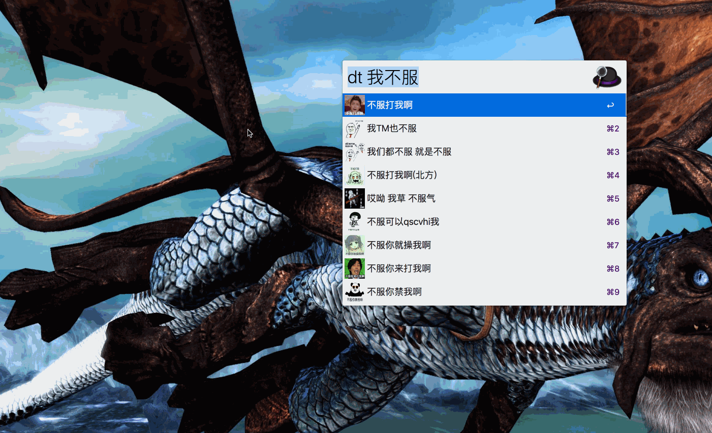

# 斗图神器

## 下载

[下载斗图神器](斗图神器.alfredworkflow)

## 检索

检索关键字: `dt`

检索快捷键:`Option+Shift+D`

下载所有图片关键字: `dadt` ,近20个进程同时下载

>  第一次检索的关键字只会显示第一页预览,搜过的关键字图片会自动缓

## 查阅

查看已下载图片数:`ls ~/Pictures/.DouTu | wc -w`

## 配置

图片默认保存在`~/Pictures/.DouTu/`下面,不要了可以直接删掉`rm -rf ~/Pictures/.DouTu`

想修改图片保存路径可以修改`config.php`文件

## 效果图

